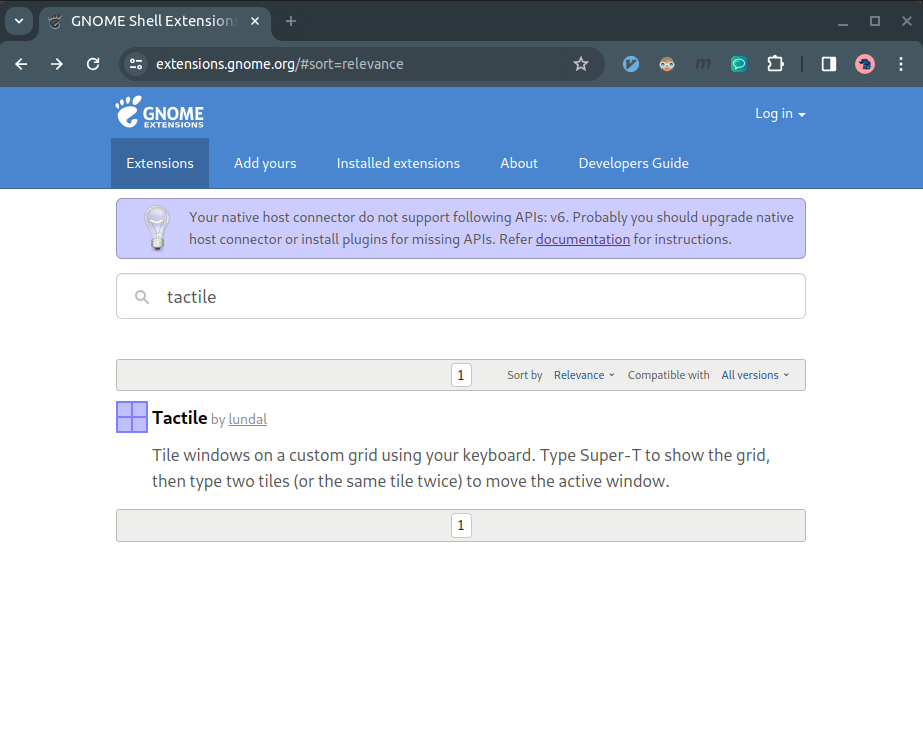
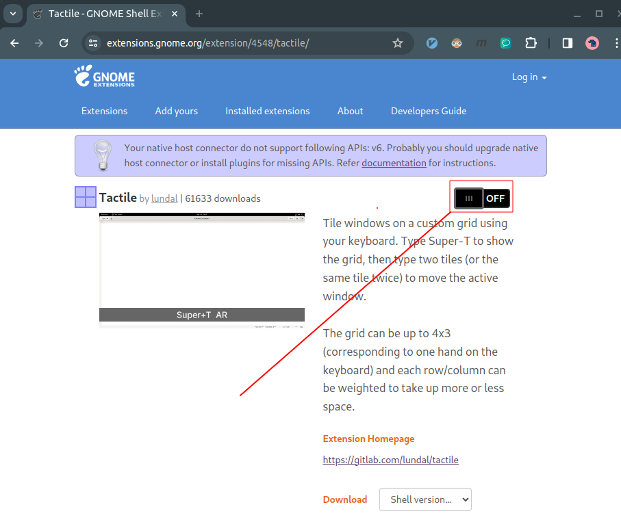
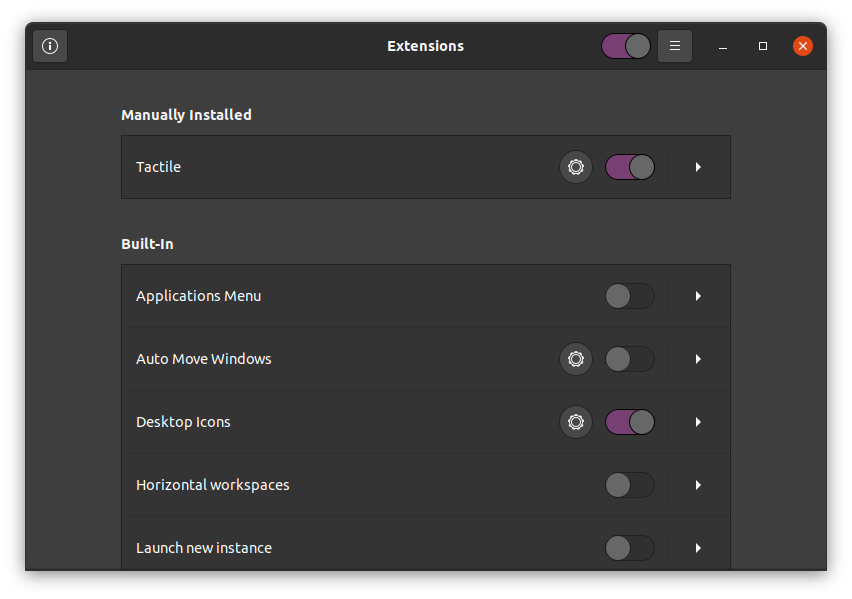
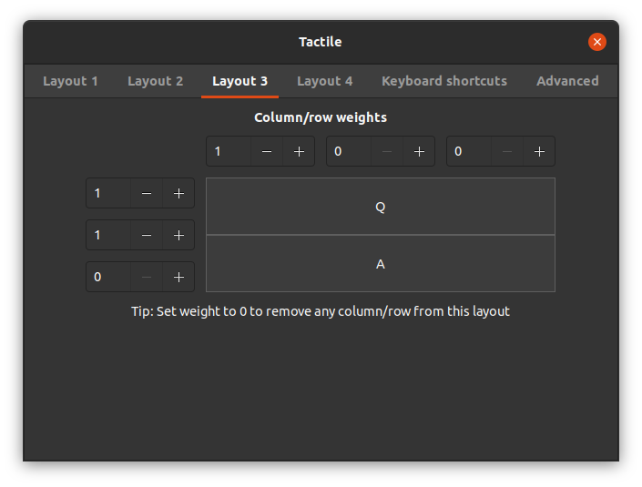

# 1. Install Tactile

## 1.1 Search Tactile on GNOME Shell Extensions


## 1.2 Install Tactile on GNOME Shell Extensions


# 2. Configure Tactile

## 2.1 Open Extensions
```
Ubuntu -> SUPER (or Windows) key -> Extensions  
```


## 2.2 Configure Tactile


# 3. Use Tactile
```
SUPER + T + NUMBER(1, 2, 3, 4) 
```

