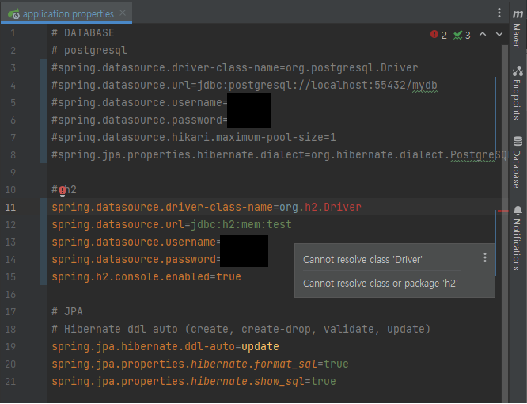
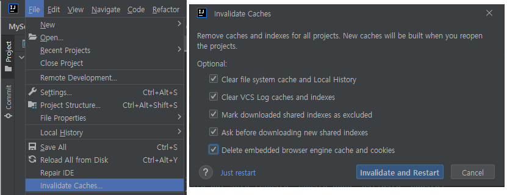
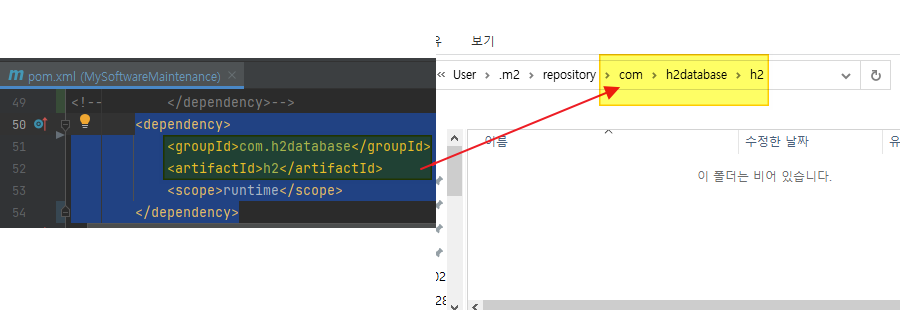
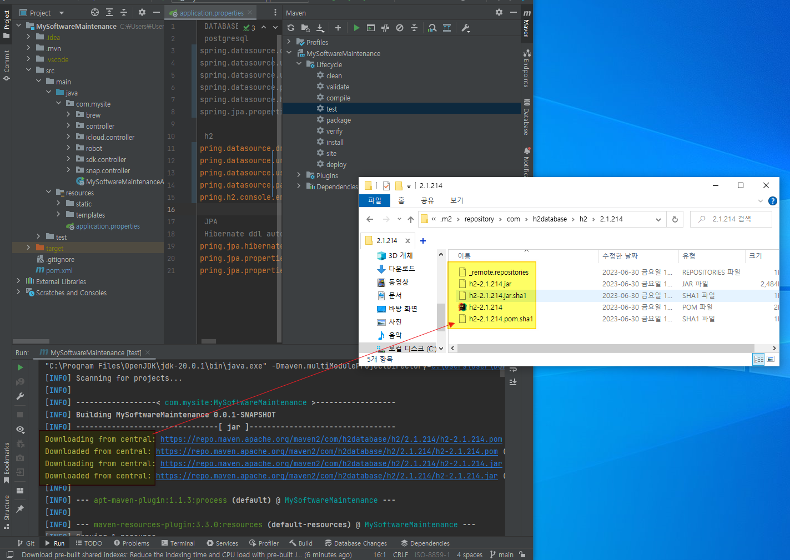
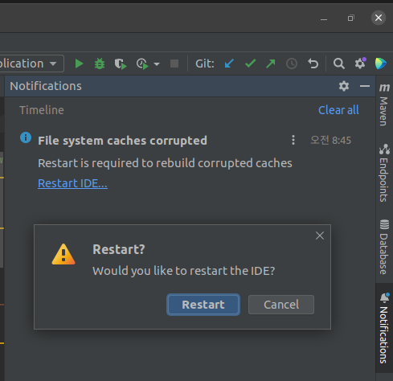
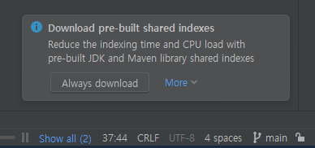

## 1. What is the problem ?
```
Cannot resolve class 'Driver'
Cannot resolve class or package'h2'
```


## 2. How to solve this problem ?
```
Solution 1.
IntellJ 
-> File
-> Invalidate Caches...
-> Invalidate and Restart
```

```
Solution 2.
-> Check pom.xml
-> Remove lib path(folder and files) of .m2 repository
```

```
-> mvn clean test # download the lib
```

```
Solution 3.
-> IntelliJ recommand restart IDE itself by detect corrupted caches.
```


## 3. Why is this problem happen?
```
[Download pre-build shared indexes] 
-> Sometimes it didn't work perfectly. Need to refresh the Caches.
```

