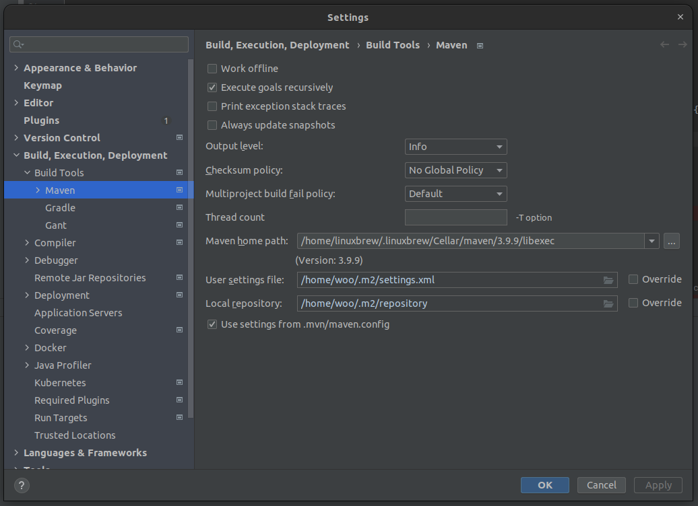
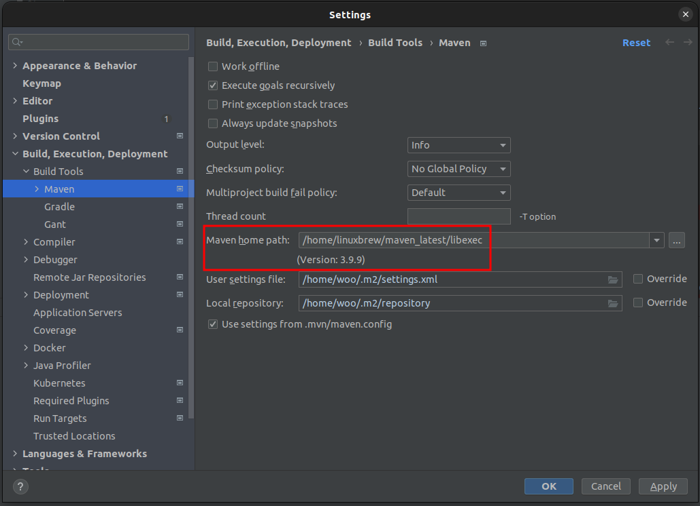

## Check the latest maven path.
```
$ ll /home/linuxbrew/.linuxbrew/Cellar/maven/
total 12
drwxrwxr-t   3 woo linuxbrew 4096  8월 18 22:08 ./
drwxrwxrwt 130 woo linuxbrew 4096  8월 26 04:03 ../
drwxr-xr-x   5 woo linuxbrew 4096  9월  9 01:43 3.9.9/
```

## Create a symbolic link for the latest maven path.
```
$ ln -s /home/linuxbrew/.linuxbrew/Cellar/maven/3.9.9/ /home/linuxbrew/maven_latest
$ ll /home/linuxbrew/maven_latest
lrwxrwxrwx 1 linuxbrew linuxbrew 29  9월  9 01:44 /home/linuxbrew/maven_latest -> .linuxbrew/Cellar/maven/3.9.9/
```

## Change [Maven home path] of IntelliJ as the symbolic link which link to the latest maven path
```
before
```

```
after
```


## Change [Maven home path] of Eclipse like the above
```
Eclipse
Window
Preferences
Maven
Installations
Add the symbolic link
```

## Why the path /home/linuxbrew/.linuxbrew/Celler/maven is not recommended for the symbolic link path for Maven ?
## Because the 'brew cleanup' command removes all the maven paths except the latest one.
```
$ brew cleanup
...
Removing: /home/linuxbrew/.linuxbrew/Cellar/maven/latest... (92 files, 10.3MB)
...

$ mvn --version
Invalid Maven home directory configured /home/linuxbrew/.linuxbrew/Cellar/maven/latest/libexec
```
