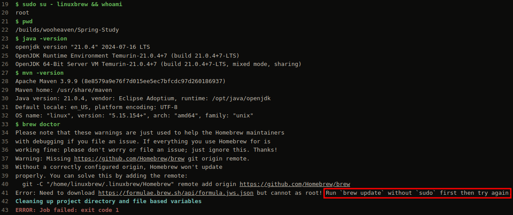
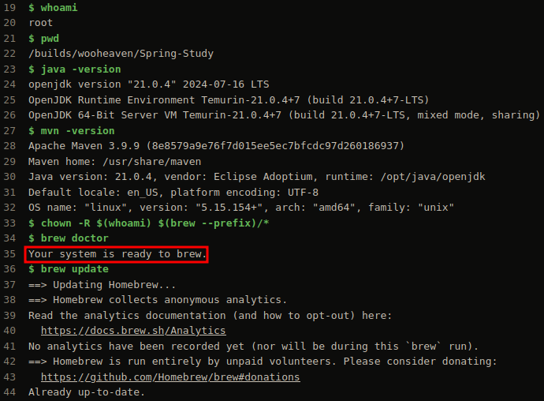

## change owner of $(brew --prefix)
```
$ chown -R $(whoami) $(brew --prefix)/*
```

## before change the owner
```
$ brew doctor
Please note that these warnings are just used to help the Homebrew maintainers
with debugging if you file an issue. If everything you use Homebrew for is
working fine: please don't worry or file an issue; just ignore this. Thanks!
Warning: Missing https://github.com/Homebrew/brew git origin remote.
Without a correctly configured origin, Homebrew won't update
properly. You can solve this by adding the remote:
  git -C "/home/linuxbrew/.linuxbrew/Homebrew" remote add origin https://github.com/Homebrew/brew
Error: Need to download https://formulae.brew.sh/api/formula.jws.json but cannot as root! Run `brew update` without `sudo` first then try again.
```

## after change the owner
```
$ chown -R $(whoami) $(brew --prefix)/*
$ brew doctor
Your system is ready to brew.
```

## before screen shot


## after screen shot


