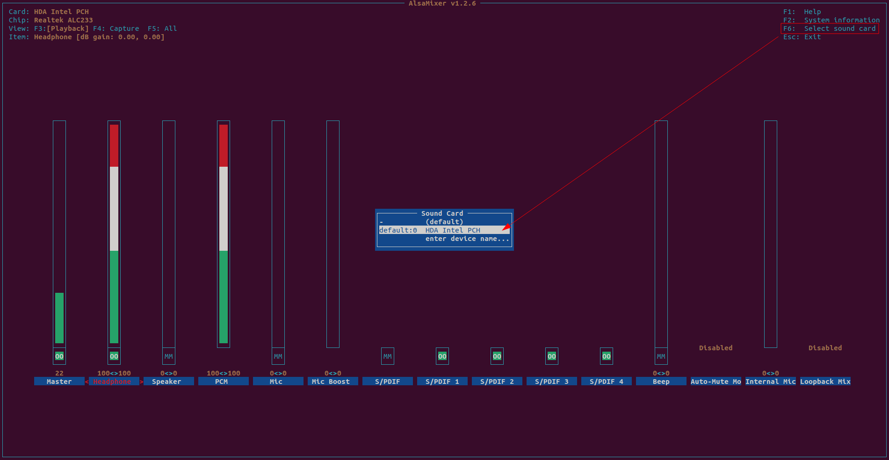
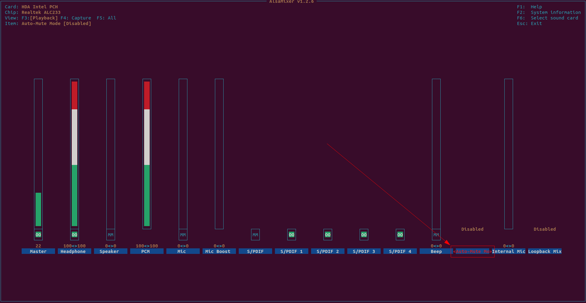
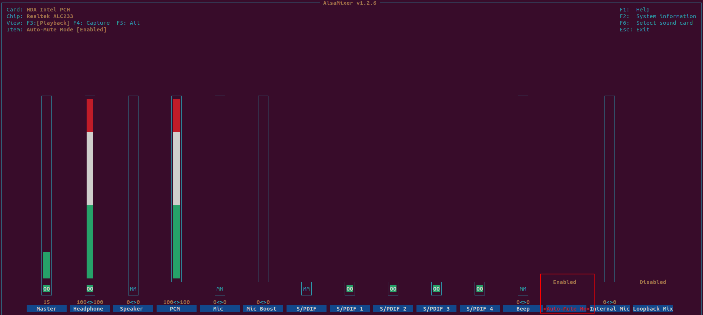
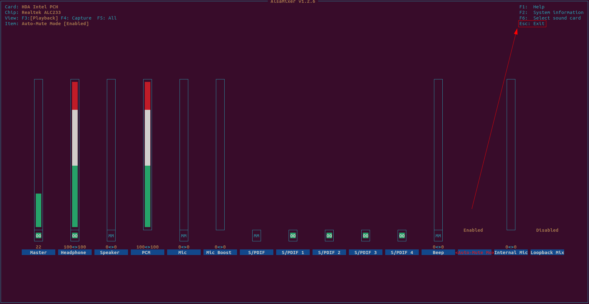

## Solution 1 : By manually, Enable Auto-Mute Mode

### Solution 1 : Step 1
```
$ sudo apt update
$ sudo apt install alsa-utils
$ alsamixer
# Press F6 to select device
```


### Solution 1 : Step 2
```
# Press right arrow to Auto-Mute Mode
```


### Solution 1 : Step 3
```
# Press up arrow to enable Auto-Mute Mode
```


### Solution 1 : Step 4
```
# Press ESC to Exit
```


### Solution 1 : Step 5
```
$ amixer -c 0 sget "Auto-Mute Mode"
Simple mixer control 'Auto-Mute Mode',0
  Capabilities: enum
  Items: 'Disabled' 'Enabled'
  Item0: 'Enabled'
```

## Solution 2 : By automatically, Enable Auto-Mute Mode
```
$ sudo vi /etc/systemd/system/enable-auto-mute-for-headphones.service

$ sudo ls -als /etc/systemd/system/enable-auto-mute-for-headphones.service 
4 -rw-r--r-- 1 root root 134  9월 22 00:02 /etc/systemd/system/enable-auto-mute-for-headphones.service

$ sudo cat /etc/systemd/system/enable-auto-mute-for-headphones.service 
[Unit]
After=network.target

[Service]
ExecStart=/usr/local/bin/enable-auto-mute-for-headphones.sh

[Install]
WantedBy=default.target

$ sudo vi /usr/local/bin/enable-auto-mute-for-headphones.sh

$ sudo ls -als /usr/local/bin/enable-auto-mute-for-headphones.sh 
4 -rw-r--r-- 1 root root 149  9월 22 00:27 /usr/local/bin/enable-auto-mute-for-headphones.sh

$ sudo cat /usr/local/bin/enable-auto-mute-for-headphones.sh 
#!/bin/bash

date > /home/enable-auto-mute-for-headphones.txt
amixer -c 0 sset "Auto-Mute Mode" Enabled >> /home/enable-auto-mute-for-headphones.txt
# amixer -c 0 sget "Auto-Mute Mode"

$ sudo chmod 744 /usr/local/bin/enable-auto-mute-for-headphones.sh
$ sudo chmod 644 /etc/systemd/system/enable-auto-mute-for-headphones.service

$ sudo systemctl daemon-reload
$ sudo systemctl enable enable-auto-mute-for-headphones.service 
Created symlink /etc/systemd/system/default.target.wants/enable-auto-mute-for-headphones.service → /etc/systemd/system/enable-auto-mute-for-headphones.service.

$ reboot
$ cat /home/enable-auto-mute-for-headphones.txt
2024. 09. 22. (일) 01:48:07 KST
Simple mixer control 'Auto-Mute Mode',0
  Capabilities: enum
  Items: 'Disabled' 'Enabled'
  Item0: 'Enabled'
```
